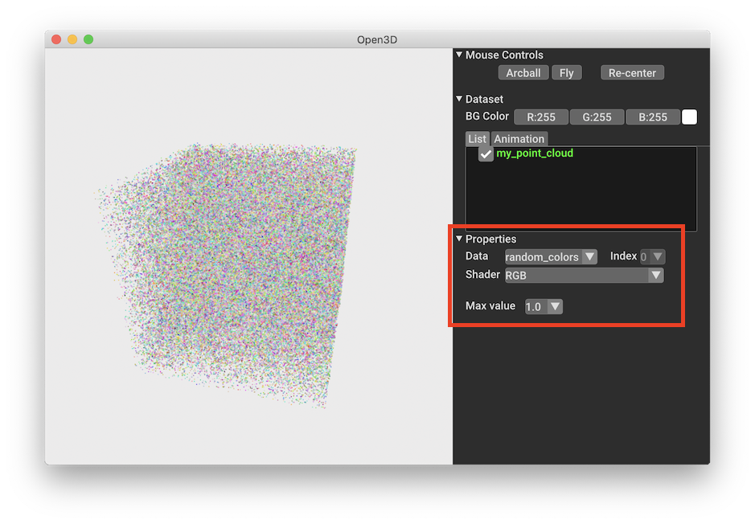
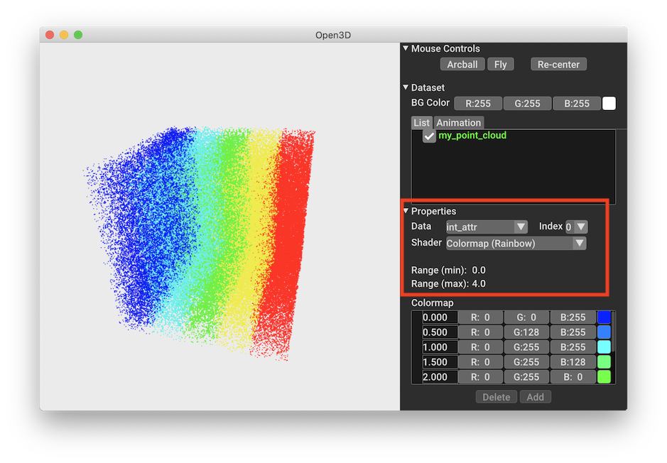
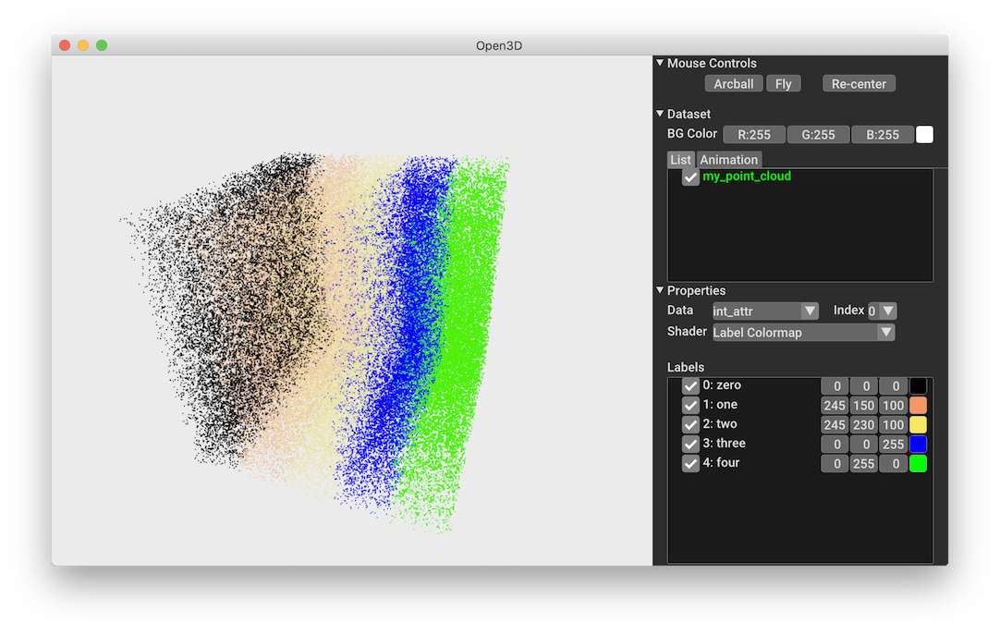

# How tos

This page is an effort to give short examples for common tasks and will be
extended over time.


## Visualize custom data

The visualizer can be used to visualize point clouds with custom attributes.
This can be useful to for example for comparing predictions and the ground truth.

Point clouds are defined as a dictionaries with mandatory entries **name** and 
**points** defining the name of the object and the point positions.
In the following example we create a single point cloud with an attribute 
**random_colors** and an integer attribute **int_attr** in the range [0,4].
The data can be passed as PyTorch tensor, TensorFlow tensors or as numpy arrays.

```python
import open3d.ml.torch as ml3d
# or import open3d.ml.tf as ml3d
import numpy as np

num_points = 100000
points = np.random.rand(num_points, 3).astype(np.float32)

data = [
    {
        'name': 'my_point_cloud',
        'points': points,
        'random_colors': np.random.rand(*points.shape).astype(np.float32),
        'int_attr': (points[:,0]*5).astype(np.int32),
    }
]

vis = ml3d.vis.Visualizer()
vis.visualize(data)
```

To visualize the **random_colors** attribute select it as _Data_ and choose the
RGB shader to directly interpret the values as colors. Max value is 1.0 in our
example.


To visualize the **int_attr** attribute select it as _Data_ and choose the
one of the colormap shaders, which will assign a color to each value. Here we
choose the rainbow colormap. Note that the colormap is automatically adjusted
to the range of the data. It is also possible to edit the colormap in the 
visualizer to adjust it to specific use cases.


### Setting a custom LUT

To use a custom LUT for visualizing attributes we first define the table with

```python
lut = ml3d.vis.LabelLUT()
lut.add_label('zero', 0)
lut.add_label('one', 1)
lut.add_label('two', 2)
lut.add_label('three', 3, [0,0,1]) # use blue for label 'three'
lut.add_label('four', 4, [0,1,0])  # use green for label 'four'
```
If nor color is provided when adding a label a color will be assigned from a default LUT.

To pass the LUT to the visualizer we associate it with the **int_attr**.
```python
vis.set_lut("int_attr", lut)
vis.visualize(data)
```
Selecting the **int_attr** in the visualizer will then switch to our LUT.



## Adding a new model

TODO


### pipeline
```
pipeline
	__init__(model, dataset, cfg)
	run_train
	run_test
	run_inference
```
### dataloader
```
dataloader
	__init__(cfg)
	save_test_result
	get_sampler(split="training/test/validation")
	get_data(file_path)
```
### model
```
model
	__init__(cfg)
	forward
	preprocess         
```
